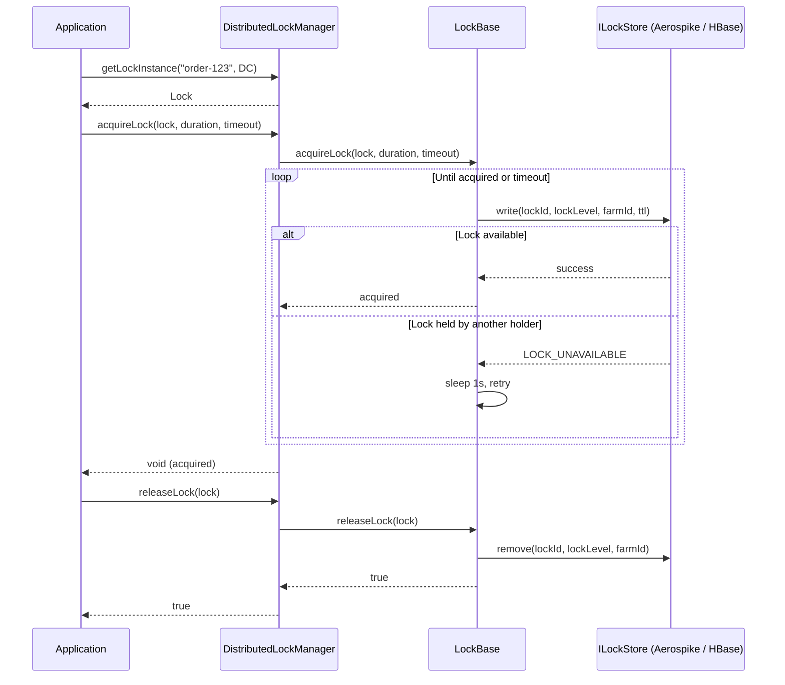

# Distributed Lock Manager

Distributed Lock Manager (DLM) is a lightweight Java library for coordinating lock acquisition and release across multiple application instances in a distributed environment.

## Why DLM?

In service-oriented architectures, concurrent access to shared resources is inevitable. DLM provides a simple, pluggable distributed locking mechanism that protects critical entities for a specified duration — without requiring a dedicated lock server.

## Key features

- **Exclusive locking** — only one holder at a time per lock identity.
- **Lock levels** — `DC` (single data center) and `XDC` (cross data center).
- **Pluggable storage backends** — Aerospike and HBase out of the box.
- **Blocking and non-blocking acquisition** — choose between immediate-fail (`tryAcquireLock`) or wait-with-timeout (`acquireLock`).
- **Automatic TTL** — every lock has a time-to-live; the lock expires even if the holder crashes.
- **Configurable lock timing** — tune TTL, wait timeout, and retry interval per `LockBase` via `LockConfiguration`.
- **Built-in retry** — configurable retry with backoff on transient storage failures.

## How it works

### Lock identity scoping

Each lock identity is scoped to a **client**. Internally the lock ID is stored as `clientId#lockId`, so two different clients can independently lock the same logical entity without conflict.

### Lock lifecycle

1. **Initialize** — `lockManager.initialize()` prepares the storage backend (e.g. creates the HBase table).
2. **Get lock instance** — `lockManager.getLockInstance(id, level)` creates a `Lock` object.
3. **Acquire** — `tryAcquireLock` / `acquireLock` writes a record to the store with a TTL.
4. **Release** — `releaseLock` removes the record from the store.
5. **Destroy** — `lockManager.destroy()` closes the underlying storage connection.

## What to read next

- [Getting Started](getting-started.md) — dependency setup, prerequisites, building locally.
- [Usage](usage.md) — initialization, acquisition, release, cleanup.
- [Locking Semantics](locking.md) — API reference, defaults, retry behavior, error codes.
- [Storage Backends](storages/aerospike.md) — Aerospike and HBase internals.
