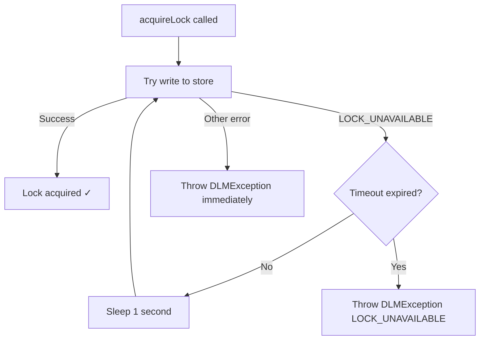

# Locking Semantics

## Lock levels

DLM supports two lock levels that control the scope of lock isolation:

### `DC` — Data Center

Locks scoped to a single data center. The storage key includes the `farmId`:

```
DC#<farmId>#<lockId>
```

Use `DC` locks when all competing instances are within the same data center. This is the **recommended default** for most workloads.

### `XDC` — Cross Data Center

Locks scoped across data centers. The storage key omits the `farmId`:

```
XDC#<lockId>
```

Use `XDC` when instances in different data centers must coordinate on the same entity.

!!! warning "XDC consistency"
    Concurrently acquiring an `XDC` lock from multiple data centers may produce unexpected behavior due to storage replication lag. For strong consistency with `XDC` locks:

    - **Aerospike** — use a strong-consistency namespace or a multi-site cluster.
    - **HBase** — ensure a single-region deployment or synchronous replication.

## Lock modes

Currently, only `LockMode.EXCLUSIVE` is supported — at most one holder per lock identity at any given time.

The `LockMode` parameter is accepted by the builder for forward compatibility. Future versions may introduce shared / limited-protected modes.

## API reference

### `tryAcquireLock` — non-blocking

| Signature | Description |
|-----------|-------------|
| `tryAcquireLock(Lock lock)` | Acquire with default TTL (**90s**). Throws immediately if unavailable. |
| `tryAcquireLock(Lock lock, Duration duration)` | Acquire with custom TTL. Throws immediately if unavailable. |

Both methods perform a **single** write attempt. If the lock is held, they throw `DLMException` with `ErrorCode.LOCK_UNAVAILABLE` without retrying.

### `acquireLock` — blocking with retry

| Signature | Description |
|-----------|-------------|
| `acquireLock(Lock lock)` | Default TTL (**90s**), default timeout (**90s**). |
| `acquireLock(Lock lock, Duration duration)` | Custom TTL, default timeout (**90s**). |
| `acquireLock(Lock lock, Duration duration, Duration timeout)` | Custom TTL and custom timeout. |

These methods enter a **retry loop**:



### `releaseLock`

```java
boolean released = lockManager.releaseLock(lock);
```

| Return value | Meaning |
|-------------|---------|
| `true` | Lock was held by this instance and has been removed from the store. |
| `false` | Lock was not held (`acquiredStatus` was already `false`). No store operation performed. |

### `getLockInstance`

```java
Lock lock = lockManager.getLockInstance("order-123", LockLevel.DC);
```

Creates a `Lock` with `lockId` set to `clientId#order-123`. No I/O is performed.

## Defaults

| Constant | Value | Description |
|----------|-------|-------------|
| `DEFAULT_LOCK_TTL_SECONDS` | `Duration.ofSeconds(90)` | How long the lock record lives in the store before auto-expiring. |
| `DEFAULT_WAIT_FOR_LOCK_IN_SECONDS` | `Duration.ofSeconds(90)` | Maximum time `acquireLock` will retry before giving up. |
| `WAIT_TIME_FOR_NEXT_RETRY` | `1000 ms` | Sleep interval between retry attempts inside `acquireLock`. |

## Error codes

All errors are surfaced as `DLMException` with one of the following codes:

| Error Code | When it occurs |
|------------|----------------|
| `LOCK_UNAVAILABLE` | Lock is currently held by another holder (Aerospike generation conflict / HBase `checkAndMutate` returned `false`). |
| `CONNECTION_ERROR` | Storage backend is unreachable or returned an I/O error. |
| `RETRIES_EXHAUSTED` | All retry attempts to the storage backend failed. |
| `TABLE_CREATION_ERROR` | HBase table creation failed during `initialize()`. |
| `INTERNAL_ERROR` | Catch-all for unexpected failures. |

### Exception propagation

`DLMException.propagate(throwable)` unwraps nested `DLMException` instances so you always receive the original error code rather than a wrapped `INTERNAL_ERROR`.

## Thread safety

- `DistributedLockManager` is **thread-safe** — it can be shared across threads.
- Each `Lock` instance tracks its own `acquiredStatus` via `AtomicBoolean`. Do **not** share a single `Lock` object across threads for concurrent acquisitions; create a new instance per thread via `getLockInstance`.
