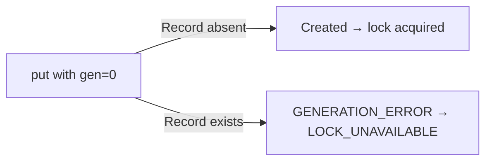

# Aerospike Backend

Use `AerospikeStore` when your workload needs low-latency lock operations backed by Aerospike's in-memory storage.

## Configuration

```java
AerospikeStore store = AerospikeStore.builder()
    .aerospikeClient(aerospikeClient) // IAerospikeClient instance
    .namespace("locks")               // Aerospike namespace
    .setSuffix("distributed_lock")    // suffix used in set name
    .build();
```

| Parameter          | Type               | Description |
|--------------------|--------------------|-------------|
| `aerospikeClient`  | `IAerospikeClient` | An already-connected Aerospike client. DLM does **not** manage the client lifecycle (except on `destroy()`). |
| `namespace`        | `String`           | The Aerospike namespace where lock records are stored. Must already exist on the cluster. |
| `setSuffix`        | `String`           | Suffix appended to the set name. The full set name is constructed from the lock level, farm ID, and this suffix. |

## How locking works

Aerospike's **generation-based optimistic concurrency (MVCC)** is used to guarantee mutual exclusion:

1. A `WritePolicy` is created with `GenerationPolicy.EXPECT_GEN_EQUAL` and `generation = 0`.
2. The `put` call succeeds only if the record **does not already exist** (generation 0).
3. If the record exists (another holder), Aerospike returns a `GENERATION_ERROR`, which DLM maps to `ErrorCode.LOCK_UNAVAILABLE`.
4. The record's `expiration` is set to the requested TTL — the lock auto-expires even if the holder crashes.



### Write policy details

| Policy field     | Value            | Reason |
|------------------|------------------|--------|
| `generationPolicy` | `EXPECT_GEN_EQUAL` | Only succeed if the record's generation matches (0 = does not exist). |
| `generation`     | `0`              | Expect the record to be absent. |
| `expiration`     | TTL in seconds   | Auto-expire the lock record. |
| `commitLevel`    | `COMMIT_MASTER`  | Commit to master only — avoids replica round-trips since no reads are performed. |

## Set naming

The Aerospike set name is constructed based on lock level:

| Lock Level | Set name format |
|------------|----------------|
| `DC`       | `DC#<farmId>#<setSuffix>` |
| `XDC`      | `XDC#<setSuffix>` |

This means `DC` locks from different farms are stored in different sets, providing natural isolation.

## Retry behavior

All Aerospike operations are wrapped in a `guava-retrying` retryer:

| Setting | Value |
|---------|-------|
| Retry on | `AerospikeException` |
| Max attempts | 5 |
| Wait between attempts | 80 ms (fixed) |
| Block strategy | Thread sleep |

If all retries are exhausted, a `DLMException` with `ErrorCode.RETRIES_EXHAUSTED` (for `remove`) or `ErrorCode.CONNECTION_ERROR` (for `write`) is thrown.

## Bin layout

Each lock record contains two bins:

| Bin name | Format | Content |
|----------|--------|---------|
| `<farmId>##data` | Integer | `1` (marker) |
| `<farmId>##uat`  | Long    | Timestamp of lock acquisition (`System.currentTimeMillis()`) |

## Initialization

`AerospikeStore.initialize()` is a **no-op** — Aerospike sets are created on first write automatically.

## Cleanup

`AerospikeStore.close()` calls `aerospikeClient.close()`. This is invoked when you call `lockManager.destroy()`.

!!! note
    If you share the `IAerospikeClient` instance with other parts of your application, be aware that `destroy()` will close it.
