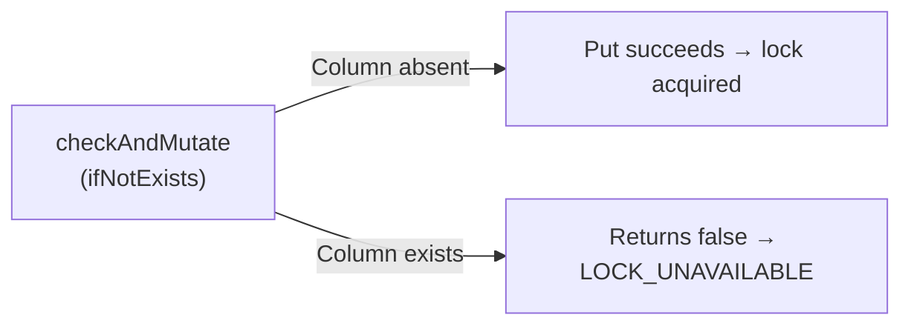

# HBase Backend

Use `HBaseStore` when your platform standard is Apache HBase and you need lock operations backed by HBase's atomic `checkAndMutate`.

## Configuration

```java
HBaseStore store = HBaseStore.builder()
    .connection(connection)   // org.apache.hadoop.hbase.client.Connection
    .tableName("dlm_locks")  // HBase table name
    .build();
```

| Parameter    | Type         | Description |
|--------------|--------------|-------------|
| `connection` | `Connection` | An already-established HBase connection. DLM does **not** create the connection, but will close it on `destroy()`. |
| `tableName`  | `String`     | Name of the HBase table used for lock storage. Created automatically by `initialize()` if it does not exist. |

## Initialization — auto table creation

When you call `lockManager.initialize()`, `HBaseStore` checks whether the table exists and creates it if needed:

```java
TableDescriptor tableDescriptor = TableDescriptorBuilder
    .newBuilder(TableName.valueOf(tableName))
    .setColumnFamily(ColumnFamilyDescriptorBuilder
        .newBuilder("D")
        .setCompressionType(Compression.Algorithm.GZ)
        .setMaxVersions(1)
        .build())
    .build();
```

The table is **pre-split** using a 256-bucket one-byte hash prefix to distribute writes evenly across regions.

!!! warning
    For best performance, **do not** pre-create the HBase table manually.
    Let DLM create it with the correct schema, column family, compression, and pre-split configuration.

If table creation fails, a `DLMException` with `ErrorCode.TABLE_CREATION_ERROR` is thrown.

## How locking works

HBase's **`checkAndMutate`** provides atomic compare-and-set semantics:

1. A `Put` is created with the lock data and a **TTL** (cell-level TTL in milliseconds).
2. `checkAndMutate` checks if the column `D:L` **does not exist** on the row.
3. If absent → the `Put` succeeds → lock acquired.
4. If present → returns `false` → DLM throws `DLMException` with `ErrorCode.LOCK_UNAVAILABLE`.



### TTL behavior

The lock TTL is set as the cell-level TTL on the `Put`:

```java
new Put(rowKey, System.currentTimeMillis())
    .setTTL(ttlSeconds * 1_000L)  // milliseconds
    .addColumn(COLUMN_FAMILY, COLUMN_NAME, COLUMN_DATA);
```

After the TTL expires, HBase automatically removes the cell, making the lock available for re-acquisition.

!!! note
    HBase cell TTL depends on the region server's compaction cycle. In practice, the cell becomes invisible to reads immediately after TTL expiry, but physical deletion happens during the next major compaction.

## Row key design

Row keys are **hash-prefixed** using `RowKeyDistributorByHashPrefix` with a `OneByteSimpleHash(256)` hasher to prevent hotspotting:

```
<1-byte-hash-prefix> + <logical-key>
```

The logical key varies by lock level:

| Lock Level | Logical key format |
|------------|-------------------|
| `DC`       | `DC#<farmId>#<lockId>` |
| `XDC`      | `XDC#<lockId>` |

## Column layout

| Column Family | Qualifier | Value |
|---------------|-----------|-------|
| `D`           | `L`       | `M` (marker byte) |

A single column family (`D`) with GZ compression and `maxVersions=1` keeps the storage footprint minimal.

## Release

`HBaseStore.remove()` issues a `Delete` on the row key. This removes the lock record immediately, without waiting for TTL expiry.

## Cleanup

`HBaseStore.close()` calls `connection.close()`. This is invoked when you call `lockManager.destroy()`.

!!! note
    If you share the `Connection` instance with other parts of your application, be aware that `destroy()` will close it.
